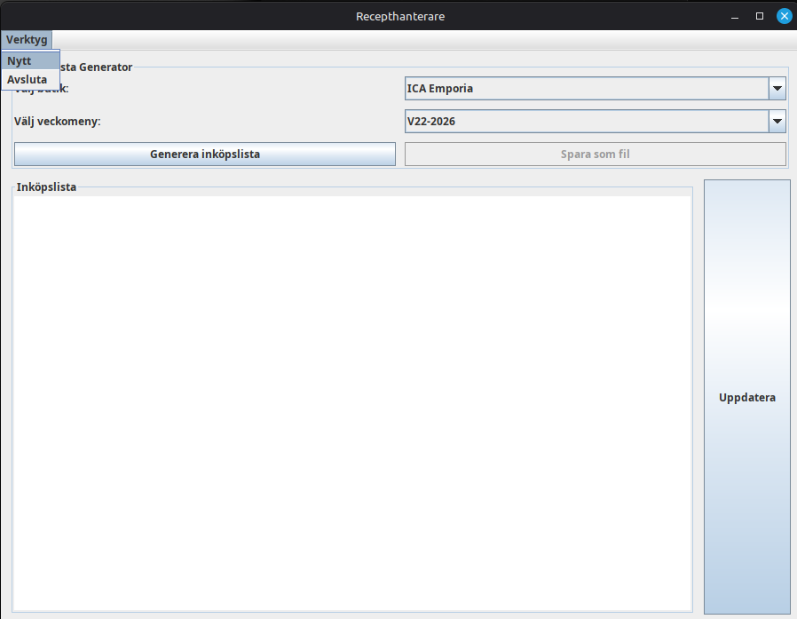
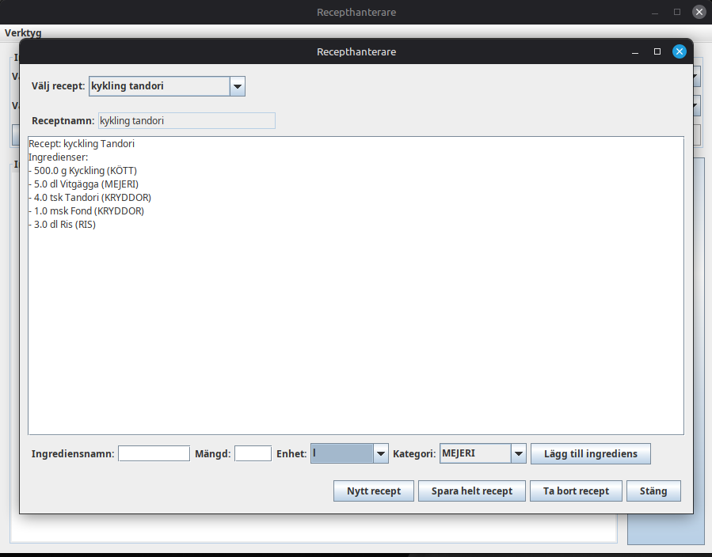
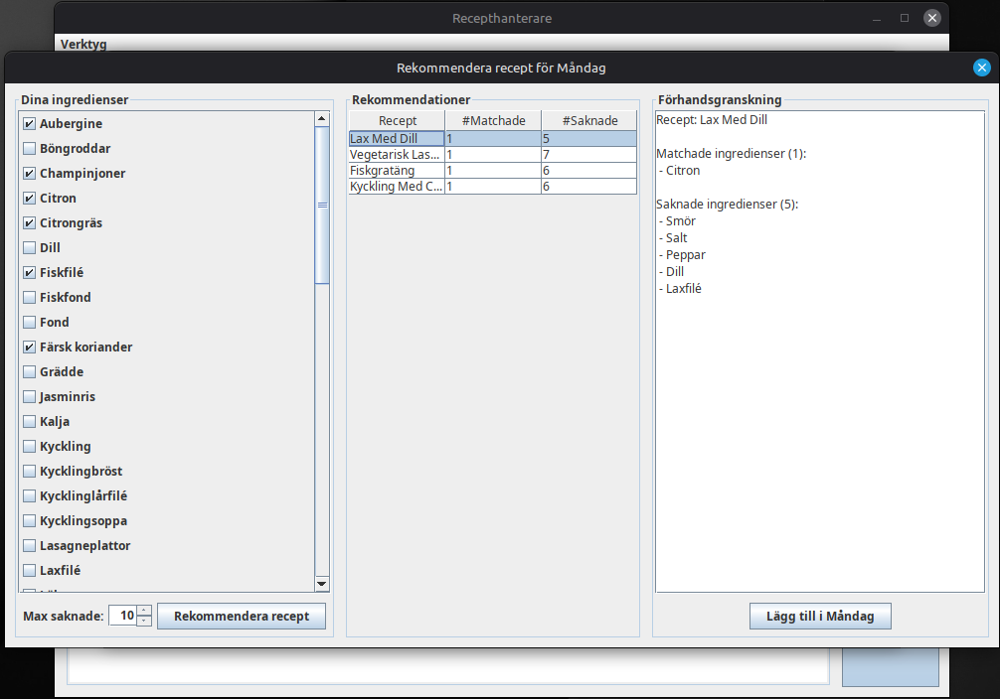
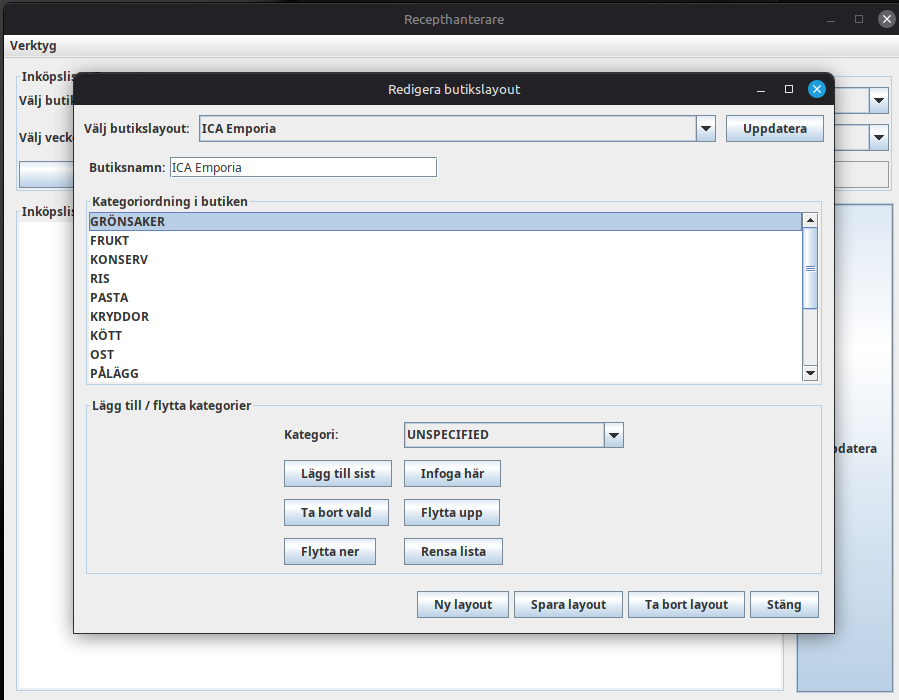

# Recepthanterare

A Java recipe and weekly menu manager built with Gradle.

This is a small app i made to train my object oriented programing and get into using gradle for building, the purpose of this app is to allow you to ease the burden of food planning by enabling creation and storage of Recepies, weekmenus and grocery shoppinglists sorted based on the layout of the store you frequent.

## Contribute

If you want to contribute feel free to fork the repo, or add suggestions of recepies or store layouts to make it more useful.

## Screenshots

Here are a few screenshots from Recepthanterare to help you understand the UI and workflow.

### Main screen


### Recipe handler


### Recipe handler


### Store layout editor



## Build

```bash
./gradlew build
```

## Create a distributable package

```bash
./gradlew distZip
```

The generated zip is available at:

```bash
build/distributions/recepthanterare.zip
```

## Run the packaged application

Unzip the distribution and use the launcher script:

```bash
unzip build/distributions/recepthanterare.zip -d dist
./dist/recepthanterare/bin/recepthanterare
```

On Windows, use:

```bat
build\distributions\recepthanterare.zip
\dist\recepthanterare\bin\recepthanterare.bat
```

## Notes

- The Gradle distribution includes all runtime dependencies.
- If you need the source or want to recompile, use `./gradlew build`.
